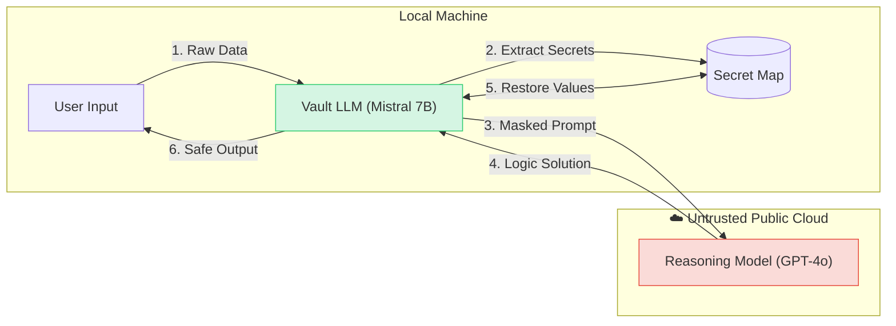

# 🛡️ Zero-Trust AI Bridge

> **Generative AI Security Layer CLI**


**Zero-Trust Bridge** enables organizations to utilize state-of-the-art Cloud LLMs (GPT-4o, Claude 3.5) on highly sensitive data without ever exposing PII or trade secrets to the provider.

It implements a **Split-Plane Architecture**:
1.  **Local Control Plane:** A local Mistral 7B model scans inputs for semantic secrets (Project Names, PII, Keys).
2.  **Cloud Reasoning Plane:** The sanitized, tokenized request is processed by the superior reasoning model.
3.  **Local Re-Assembly:** The bridge intercepts the response and cryptographically restores the secrets.

---

## 🏗 System Architecture

The system uses a "Masquerade" pattern to decouple semantic understanding from logical reasoning.




## 🛠️ Quick Start

### 1. Prerequisites
* Python 3.10+
* `llama-server` (from [llama.cpp](https://github.com/ggerganov/llama.cpp))
* A GGUF Model (e.g., Mistral-7B-Instruct-v0.3)

### 2. Start the Local Security Guard and create .env file
This runs the local model that scans for secrets. You must keep this terminal window open.
```bash
/path/to/llama-server -m Mistral-7B-Instruct.gguf --port 8080 -c 4096

# OPENAI_API_KEY=sk-your-key-here in your root file .env
```

### 3. Run 
```bash
pip install -r requirements.txt
python bridge.py
```


